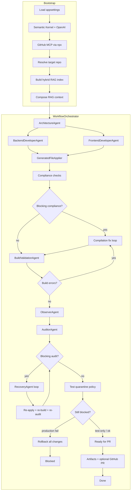

# agents-mcp-rag

Multi-agent development workflow for a **target repository**. It uses **Semantic Kernel** (OpenAI), **local hybrid RAG** (lexical + embeddings), and the **GitHub MCP server** to plan, generate, validate, audit, recover, and optionally open a pull request—all while following patterns discovered in the existing codebase.

## What it does

Given a task (e.g. “add a Timesheet entity like Employee”), the system:

1. Indexes and retrieves relevant code from the target repo.
2. Plans architecture, then generates backend and frontend files in parallel.
3. Applies changes with safety gates (syntax, layer conventions, interface parity).
4. Runs deterministic compliance checks and `dotnet build`.
5. Audits output and recovers from failures in a loop.
6. Separates **production** vs **test** build failures so bad unit tests do not roll back good production code.
7. Writes workflow artifacts and optionally creates a GitHub PR via MCP.

## Prerequisites

| Requirement | Purpose |
|-------------|---------|
| [.NET 8 SDK](https://dotnet.microsoft.com/download) | Build and run the app |
| [Node.js](https://nodejs.org/) + `npx` | GitHub MCP server (`@modelcontextprotocol/server-github`) |
| OpenAI API key | Chat + embeddings (hybrid RAG) |
| GitHub PAT | MCP GitHub tools (PR/status) |
| Local path or Git URL | Target repo to modify |

## Quick start

### 1. Configure

Edit `agents-mcp-rag/appsettings.json`:

```json
{
  "OpenAI": {
    "ApiKey": "sk-...",
    "ChatModel": "gpt-4o-mini",
    "EmbeddingModel": "text-embedding-3-small"
  },
  "GitHub": {
    "Pat": "github_pat_..."
  },
  "Repo": {
    "Path": "/absolute/path/to/your/target-repo"
  },
  "Workflow": {
    "MaxRecoveryAttempts": 3,
    "MaxCompilationFixAttempts": 3,
    "UseHybridRag": true,
    "RagLexicalWeight": 0.55,
    "RagVectorWeight": 0.45,
    "DefaultTaskPrompt": "Your default task when no CLI args are passed.",
    "AutoCreatePullRequest": true,
    "PullRequestBaseBranch": "main"
  }
}
```

`Repo.Path` can be a local directory or a remote URL (`https://...`, `git@...`). Remote repos are cloned into a local cache under `~/Library/Application Support/agents-mcp-rag/repo-cache` (macOS).

> **Security:** Do not commit real API keys. Use placeholders in git and keep secrets in a local-only `appsettings.Local.json` (ignored by `.gitignore`) if needed.

### 2. Build

```bash
cd agents-mcp-rag
dotnet build agents-mcp-rag.sln
```

### 3. Run

```bash
dotnet run --project agents-mcp-rag/agents-mcp-rag.csproj
```

With a custom task prompt:

```bash
dotnet run --project agents-mcp-rag/agents-mcp-rag.csproj -- \
  "Implement Timesheet entity with repository, Web API controller, and AngularJS files matching Employee patterns."
```

If no CLI arguments are provided, `Workflow.DefaultTaskPrompt` from config is used.

---

## End-to-end flow



### Stage-by-stage

| Step | Component | Description |
|------|-----------|-------------|
| **1** | `AppSettingsLoader` | Loads `appsettings.json` from project or parent directories. |
| **2** | `KernelFactory` | Creates Semantic Kernel with OpenAI chat completion. |
| **3** | `GitHubMcpClientFactory` | Starts `@modelcontextprotocol/server-github` over stdio. |
| **4** | `RepositoryResolver` | Uses local repo or clone/pull remote URL into cache. |
| **5** | `CodebaseRagIndex` | Scans code files; builds lexical + vector (OpenAI embeddings) index. |
| **6** | `RagContextComposer` | Structure profile, legacy patterns, retrieval for task, expected paths. |
| **7** | `ArchitectureAgent` | Plan: rationale, backend/frontend tasks, test strategy. |
| **8** | `BackendDeveloperAgent` / `FrontendDeveloperAgent` | Parallel JSON file generation (paths + full content). |
| **9** | `GeneratedFileApplier` | Canonical paths, duplicate prevention, C# guards, writes files. |
| **10** | Compliance (deterministic) | Repository contracts, path conventions, missing unit tests. |
| **11** | Compilation fix loop | `RecoveryAgent` + re-apply (up to `MaxCompilationFixAttempts`). |
| **12** | `BuildValidationAgent` | Full solution build + per-project production build. |
| **13** | `ObserverAgent` | Integration / cross-cutting review. |
| **14** | `AuditorAgent` | LLM audit + merged compliance/build findings. |
| **15** | Recovery loop | Up to `MaxRecoveryAttempts` if blocking audit findings remain. |
| **16** | Test release policy | Quarantine failing test artifacts; keep production changes. |
| **17** | Final gate | Rollback only on **production** build failure; else PR path. |
| **18** | `WorkflowArtifactWriter` | Persists timeline and summaries. |
| **19** | `GitHubMcpAdapter` | Optional PR creation on target repo. |

### Workflow stages (`WorkflowStage`)

```
Queued → Planning → Implementing → Integrating → Auditing
                              ↘ Recovering (loop) ↗
→ ReadyForPR → Done
   or Blocked (rollback / unresolved findings)
```

---

## Agents

| Agent | Role |
|-------|------|
| **ArchitectureAgent** | High-level plan and task breakdown. |
| **BackendDeveloperAgent** | C# / API / repository / entity / test files (JSON output). |
| **FrontendDeveloperAgent** | JS/TS/HTML/Angular-style files (JSON output). |
| **BuildValidationAgent** | `dotnet build` on solution + non-test projects (`ProductionBuildPassed`). |
| **ObserverAgent** | Post-build integration observation. |
| **AuditorAgent** | Release-readiness review; merges with deterministic findings. |
| **RecoveryAgent** | Targeted fixes from audit/build/compliance issues (JSON file patches). |

All LLM agents share `LlmWorkflowAgentBase` and consume `WorkflowState.CombinedRagContext`.

---

## RAG pipeline

- **Scanner:** `RepoCodeFileScanner` — relevant source extensions, skips `bin`/`obj`/noise.
- **Chunking:** Semantic Kernel text chunking per file.
- **Hybrid retrieval** (`UseHybridRag: true`):
  - **Lexical** — term overlap (weight `RagLexicalWeight`, default `0.55`).
  - **Vector** — OpenAI embeddings (weight `RagVectorWeight`, default `0.45`).
- **Composer:** `RagContextComposer` merges structure, conventions, exemplar snippets, and task-specific retrieval into `CombinedRagContext` passed to every agent.

Embeddings are held **in memory** for the run (not persisted to a vector DB).

---

## Safety and compliance (deterministic)

These run without the LLM and produce `AgentFinding` entries (High/Blocker can trigger recovery):

| Check | Class | What it enforces |
|-------|--------|------------------|
| Repository contracts | `ValidateRepositoryContracts` | `I{Entity}Repository`, inheritance, ctor/base patterns. |
| Path conventions | `ValidatePathConventions` | Controllers, indexes, duplicate index files. |
| Missing tests | `TestCoverageAuditor` | `{Entity}RepositoryTests.cs` when `RepositoryTest` exemplars exist. |
| File quality | `GeneratedFileApplier` | Non-prose, C# shape, layer profiles, interface parity. |
| Test syntax | `CSharpSyntaxGuard` | Balanced braces; rejects `;;` and similar. |
| Test template | `RepositoryTestTemplateBuilder` | Clones sibling `*RepositoryTests.cs` if LLM output is invalid. |

### Production vs test build failures

| Situation | Behavior |
|-----------|----------|
| Production projects fail | Full rollback of generated changes → **Blocked**. |
| Only test project fails | **Quarantine** test files, defer test entity, downgrade to Medium findings, **keep production code**, continue to PR. |
| Production passes, tests deferred | Timeline notes “Proceeding with production changes…”. |

---

## Project structure

```
agents-mcp-rag/
├── agents-mcp-rag.sln
├── global.json
├── README.md
├── .gitignore
└── agents-mcp-rag/
    ├── Program.cs                 # Entry point
    ├── appsettings.json           # Configuration
    ├── Application/
    │   └── ApplicationHost.cs     # Wires settings → kernel → MCP → runner
    ├── Configuration/
    │   ├── AppSettings.cs
    │   └── AppSettingsLoader.cs
    ├── Workflow/
    │   ├── WorkflowRunner.cs      # RAG + orchestrator
    │   └── WorkflowResultPrinter.cs
    ├── Orchestration/
    │   └── WorkflowOrchestrator.cs
    ├── Agents/                    # Architecture, Backend, Frontend, Audit, Recovery, Build
    ├── Infrastructure/            # RAG, applier, MCP, git, compliance helpers
    └── Models/
        └── WorkflowModels.cs
```

---

## Configuration reference

| Key | Description |
|-----|-------------|
| `OpenAI:ApiKey` | OpenAI API key. |
| `OpenAI:ChatModel` | Chat model (e.g. `gpt-4o-mini`). |
| `OpenAI:EmbeddingModel` | Embedding model for hybrid RAG. |
| `GitHub:Pat` | GitHub personal access token for MCP. |
| `Repo:Path` | Local path or Git remote URL of target repo. |
| `Workflow:MaxRecoveryAttempts` | Auditor/recovery loop limit. |
| `Workflow:MaxCompilationFixAttempts` | Recovery-driven compile fix limit. |
| `Workflow:UseHybridRag` | Enable lexical + vector retrieval. |
| `Workflow:RagLexicalWeight` / `RagVectorWeight` | Hybrid score weights (should sum ~1). |
| `Workflow:DefaultTaskPrompt` | Task used when no CLI args. |
| `Workflow:AutoCreatePullRequest` | Create PR via MCP when workflow succeeds. |
| `Workflow:PullRequestBaseBranch` | Base branch for PR (e.g. `main`). |

---

## Output

- **Console:** Step banners, agent summaries, timeline.
- **Artifacts:** Written under the target repo (or configured artifact path) by `WorkflowArtifactWriter` on success.
- **GitHub:** PR URL/status when `AutoCreatePullRequest` is enabled and the target is a git repo.

Example timeline lines:

```
2026-05-18T09:49:18Z | Architecture planning started.
2026-05-18T09:49:18Z | Generated files applied: SinglePageSample.Repository/...
2026-05-18T09:49:18Z | Build validation passed.
2026-05-18T09:49:18Z | Workflow ready for PR.
```

## License

Add your license here (e.g. MIT) if you open-source this repository.
