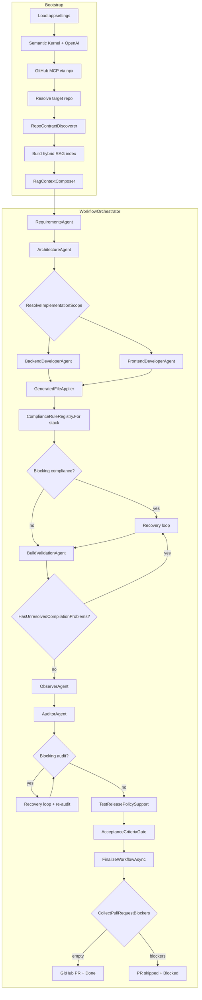

# workflowX

[License: MIT](LICENSE)

**Topics:** `semantic-kernel` · `multi-agent` · `workflow-automation` · `sdlc`

Multi-agent development workflow for a **target repository**. It uses **Semantic Kernel** (OpenAI), **local hybrid RAG** (lexical + embeddings), and the **GitHub MCP server** to capture requirements, plan architecture, generate code, validate builds, audit, recover, verify acceptance criteria, write artifacts, and optionally open a pull request—all while following patterns discovered in the existing codebase.

The orchestrator **runs every stage to completion**; failures are recorded as PR blockers but do not stop later stages. A pull request is created only when no blockers remain.

The orchestrator is **stack-aware**: it discovers repo capabilities once, then routes apply, RAG, compliance, build validation, recovery, and test-release policy through thin generic facades into **DotNet** or **Frontend** plug-in assemblies.

## Prompt-first migration (.NET)

Several behaviors that used to live in deterministic discoverers, apply guards, and compliance auditors are now driven by **agent prompts** and **RAG text** (solution project list from `.sln`, `TestBootstrapContext`, shared placement rules).

| Formerly in code (removed or empty) | Now enforced via |
| ----------------------------------- | ---------------- |
| `TestCoverageAuditor` / `testing.missing-tests` compliance rule | `AuditorAgent` prompt → JSON `findings[]` (`high` for missing `*Tests.cs`); `BackendDeveloperAgent` / `ArchitectureAgent` prompts |
| `DotNetTestReleasePolicy` / test quarantine | Removed — fix failing tests through recovery prompts; no test-artifact rollback policy |
| RAG task scoring + ranked exemplar categories (`AppendBackendExemplarCategories`) | Hybrid semantic RAG + solution project directories; agents copy exemplar paths from context |
| Apply path canonicalization / `CompositionRootMerger` / layer apply guards | Agents emit final paths; apply is pass-through (+ existing scope/overwrite/syntax gates) |
| `DotNetRepoContractDiscoverer` layer/path rules on contract | `ArchitectureAgent` + `CSharpPromptSupport` + RAG solution projects |
| `CodeExemplarContext.AppendDiscoveredExemplars` (task-scored snippets) | Dropped — semantic RAG + agent prompts |

**Still deterministic (not moved to prompts):** `ArchitectureCoverageComplianceRule`, `ArchitectureDeliverableScopeGuard`, `dotnet build` / `dotnet test`, `BuildFailureClassifier`, `CSharpCompilationFixSupport` exemplar files for recovery.

**Auditor wiring:** `AuditorAgent` returns parsed `findings[]`; `RefreshComplianceAuditFindings` keeps auditor **high** / **blocker** findings (not only low/medium) and merges compliance + build findings.

## Solution layout

Eight projects; dependency flow is **Host → Core + PlugIns.DotNet + PlugIns.Frontend**, *PlugIns. → Core**. Test projects mirror stack plug-ins plus a shared helpers library and host integration tests.


| Project                                | Role                                                                                                                                |
| -------------------------------------- | ----------------------------------------------------------------------------------------------------------------------------------- |
| `**workflowX.Core`**                   | Shared contracts: `WorkflowState`, `RepoContract`, `RepoStack`, compliance/apply models, `IStackModule`, `StackModuleRegistry`      |
| `**workflowX.PlugIns.DotNet**`         | .NET stack plug-in: apply shape checks, build validation, RAG/placement prompts, `DotNetPluginRegistration`                     |
| `**workflowX.PlugIns.Frontend**`       | Frontend stack plug-in: apply guards, compliance rules, build validation, RAG context, repo discovery, `FrontendPluginRegistration` |
| `**workflowX**`                        | Host executable: agents, orchestrator, generic routers (`GeneratedFileApplier`, `RagContextComposer`, …)                            |
| `**workflowX.Tests**`                  | Host/integration xUnit tests (`RepoStack`, cross-stack orchestration)                                                               |
| `**workflowX.Tests.Common**`           | Shared test helpers (`TempRepo`, `WorkflowStateBuilder`, `StackModuleTestSetup`)                                                    |
| `**workflowX.PlugIns.DotNet.Tests**`   | DotNet plug-in xUnit tests                                                                                                          |
| `**workflowX.PlugIns.Frontend.Tests**` | Frontend plug-in xUnit tests                                                                                                        |


```
workflowX.sln
├── workflowX.Core/
├── workflowX.PlugIns.DotNet/
├── workflowX.PlugIns.Frontend/
├── workflowX/                 # host
├── workflowX.Tests.Common/
├── workflowX.Tests/
├── workflowX.PlugIns.DotNet.Tests/
└── workflowX.PlugIns.Frontend.Tests/
```

Host startup registers stack modules via `StackModuleRegistration.RegisterDefaults()` → `DotNetPluginRegistration.Register()` + `FrontendPluginRegistration.Register()`.

## What it does

Given a task (e.g. “add a Timesheet entity like Employee”), the system:

1. Discovers **RepoContract** (lightweight stack flags + frontend template; placement/tests via prompts) and sets `**contract.Stack`**.
2. Indexes and retrieves relevant code from the target repo (extensions and exemplars gated by stack).
3. Runs **requirements intake** → structured **RequirementsSpec** with acceptance criteria.
4. Plans architecture → structured **ArchitecturePlan** (JSON with backend/frontend file lists; markdown fallback).
5. Generates backend and/or frontend files in parallel (scope from architecture plan + contract).
6. Applies agent paths **pass-through** with scope/overwrite/syntax gates (no path remapping or DI merge).
7. Runs deterministic compliance rules selected by stack (`ComplianceRuleRegistry.For(stack)`).
8. Validates builds per stack (`.NET`: `dotnet build` / `dotnet test`; frontend: `npm run build`).
9. Audits output and recovers from failures in a loop.
10. Merges auditor JSON findings with compliance/build output (no DotNet test quarantine).
11. Runs the **acceptance criteria gate** (deterministic checks + LLM validation against requirements).
12. Writes workflow artifacts (always) and creates a GitHub PR via MCP **only when no blockers remain**.

---

## Stack-aware architecture

Discovery happens **once** at bootstrap. Every downstream subsystem reads `RepoContract.Stack` (or `RepoStack.From(state)`).

```
RepoContractDiscoverer.Discover(repoPath)
  └── RepoContract
        ├── Stack.DotNet     (*.csproj present)
        ├── Stack.Frontend   (frontend module template discovered)
        └── discovered data  (PathRules, Frontend template, LayerConventions, …)

RepoStack routes at orchestration boundaries:
  ├── ApplyContextFactory / GeneratedFileApplier     → PlugIns.DotNet (CSharpApplySupport — basic shape only)
  ├── RagContextComposer                             → PlugIns.DotNet/CSharpRagContextSupport + PlugIns.Frontend/FrontendRagContextSupport
  ├── StackModuleRegistry                            → IStackModule plug-ins (compliance + test-release per stack)
  ├── ComplianceRuleRegistry.For(stack)              → shared rules + active module compliance rules
  ├── BuildValidationAgent                           → PlugIns.DotNet/DotNetBuildValidationSupport + PlugIns.Frontend/FrontendBuildValidationSupport
  ├── RecoveryContextSupport                         → PlugIns.DotNet/CSharpCompilationFixSupport
  └── TestReleasePolicySupport                       → composite ITestReleasePolicy from active modules
```


| Layer        | Generic (host / Core)                                                                                          | DotNet (`workflowX.PlugIns.DotNet`)       | Frontend (`workflowX.PlugIns.Frontend`) |
| ------------ | -------------------------------------------------------------------------------------------------------------- | ----------------------------------------- | --------------------------------------- |
| Apply        | `ApplyContentGuard`, `ApplyContext` (Core), `ApplyContextFactory`, `GeneratedFileApplier`                      | `CSharpApplySupport` (basic C# shape)     | `FrontendApplyGuard`                    |
| RAG          | `RagContextComposer`, `RepoCodeFileScanner`                                                                    | `CSharpRagContextSupport`                 | `FrontendRagContextSupport`             |
| Compliance   | `ComplianceRuleRegistry`, `ContractComplianceValidator`, `ComplianceContext` (Core), `ComplianceContextFactory`, `StackModuleRegistry` (Core) | `DotNetStackModule` → rules + test policy | `FrontendStackModule` → rules           |
| Build        | `BuildValidationAgent`                                                                                         | `DotNetBuildValidationSupport`            | `FrontendBuildValidationSupport`        |
| Recovery     | `RecoveryContextSupport`, `WorkflowFindingRules`                                                               | `CSharpCompilationFixSupport`             | proposed-files-only fallback            |
| Test release | `TestReleasePolicySupport` (composite)                                                                         | **null** (prompt-first; no quarantine)    | no policy yet (null on module)          |


**Convention:** Stack-specific logic lives in `**workflowX.PlugIns.DotNet`** or `**workflowX.PlugIns.Frontend**` (namespaces `*.DotNet` / `*.Frontend`). Shared types and plug-in interfaces live in **Core**. Generic orchestrators stay in the **host** and route with `RepoStack` helpers (`WhenDotNet`, `WhenFrontend`, `DotNetOr`, …). See [RepoStack](#repostack) below.

---

## RepoStack

`RepoStack` (`workflowX.Core/Infrastructure/RepoContract/RepoStack.cs`) is a small **routing snapshot**: two booleans that say whether the discovered repo has a .NET backend and/or a frontend module layout.

```csharp
readonly record struct RepoStack(bool DotNet, bool Frontend)
```


| Member                               | Purpose                                                                                                                      |
| ------------------------------------ | ---------------------------------------------------------------------------------------------------------------------------- |
| `RepoStack.None`                     | Neither stack (`DotNet: false`, `Frontend: false`)                                                                           |
| `contract.Stack`                     | Authoritative flags after discovery (see table below)                                                                        |
| `RepoStack.From(contract)`           | Same as `contract.Stack`                                                                                                     |
| `RepoStack.From(state)`              | Uses `state.Contract.Stack` when present; otherwise infers from RAG structure text (fallback for tests / pre-contract paths) |
| `WhenDotNet` / `WhenFrontend`        | Run an action only when that stack is active                                                                                 |
| `WhenDotNet<T>` / `WhenFrontend<T>`  | Return items or `Enumerable.Empty<T>()`                                                                                      |
| `DotNetOr<T>(whenDotNet, otherwise)` | Pick a value by stack                                                                                                        |


**How `contract.Stack` is derived** (single public API — no separate `HasDotNetBackend` / `HasFrontend` properties):


| Flag             | True when                                                                                                                |
| ---------------- | ------------------------------------------------------------------------------------------------------------------------ |
| `Stack.DotNet`   | At least one `*.csproj` under the repo (excluding `bin`/`obj`)                                                          |
| `Stack.Frontend` | A frontend module template was discovered (`Frontend is not null`)                                                       |


Mixed repos set both flags. Downstream code should read `**contract.Stack`** or `**RepoStack.From(state)**` and branch on `stack.DotNet` / `stack.Frontend` — not re-scan the repo or duplicate discovery heuristics. Routing boundaries are listed under [Stack-aware architecture](#stack-aware-architecture).

Unit tests: `workflowX.Tests/Infrastructure/RepoStackTests.cs`.

### Stack plug-ins (`IStackModule`)

Stack-specific compliance and test-release policy register through `**StackModuleRegistry**` (Core) — host orchestrators never reference plug-in rule types directly (`DotNetComplianceRules.All` is empty).

```
ApplicationHost / tests
  └── StackModuleRegistration.RegisterDefaults()
        ├── DotNetPluginRegistration.Register()  → DotNetStackModule (PlugIns.DotNet)
        └── FrontendPluginRegistration.Register() → FrontendStackModule (PlugIns.Frontend)

ComplianceRuleRegistry.For(stack)  → shared rules + StackModuleRegistry.ComplianceRules(stack)
TestReleasePolicySupport           → composite over StackModuleRegistry.TestReleasePolicies(stack)
```

To add a stack: implement `IStackModule` in a new plug-in project (reference Core only), call `StackModuleRegistry.Register(module)` at host startup via a `*PluginRegistration` entry point.

---

## Repository contract

`RepoContractDiscoverer` scans the target repo once at startup. `**RepoContractComposer**` merges frontend discovery (`**FrontendRepoContractDiscoverer**`) and sets `HasDotNetProjects` from `*.csproj` (no DotNet layer/path discoverer). `**RepoContract.Stack**` is the routing entry point.


| Signal                              | Stored on contract                                                              | Used for                                                                                          |
| ----------------------------------- | ------------------------------------------------------------------------------- | ------------------------------------------------------------------------------------------------- |
| `Stack.DotNet`                      | `HasDotNetProjects`                                                             | C# apply shape checks, `dotnet` build/test, compilation-fix context, placement prompts            |
| `Stack.Frontend`                    | Derived (`Frontend != null`)                                                    | Frontend RAG, path rules, `npm run build`                                                         |
| Frontend template                   | `Frontend`                                                                      | Frontend compliance path rules                                                                    |


Agents and compliance checks use this contract instead of hardcoded project-specific playbooks.

---

## Prerequisites


| Requirement                                         | Purpose                                                |
| --------------------------------------------------- | ------------------------------------------------------ |
| [.NET 8 SDK](https://dotnet.microsoft.com/download) | Build and run the app                                  |
| [Node.js](https://nodejs.org/) + `npx`              | GitHub MCP server; frontend `npm run build` validation |
| OpenAI API key                                      | Chat + embeddings (hybrid RAG)                         |
| GitHub PAT                                          | MCP GitHub tools (PR/status)                           |
| Local path or Git URL                               | Target repo to modify                                  |


---

## Quick start

### 1. Configure

Edit `workflowX/appsettings.json`:

```json
{
  "OpenAI": {
    "ApiKey": "sk-...",
    "ChatModel": "gpt-4o-mini",
    "EmbeddingModel": "text-embedding-3-small"
  },
  "GitHub": {
    "Pat": "github_pat_..."
  },
  "Repo": {
    "Path": "/absolute/path/to/your/target-repo"
  },
  "Workflow": {
    "MaxRecoveryAttempts": 3,
    "MaxCompilationFixAttempts": 3,
    "CompilationFixMaxContextChars": 200000,
    "CompilationFixMaxOptionalFiles": 0,
    "UseHybridRag": true,
    "RagLexicalWeight": 0.55,
    "RagVectorWeight": 0.45,
    "DefaultTaskPrompt": "Your default task when no CLI args are passed.",
    "ResumeFromCheckpoint": true,
    "StartFromStage": null,
    "AutoCreatePullRequest": true,
    "PullRequestBaseBranch": "main",
    "AcceptanceCriteria": {
      "Enabled": true,
      "MinimumCriteriaCount": 1,
      "RequireProductionBuildPass": true
    }
  }
}
```

`Repo.Path` can be a local directory or a remote URL (`https://...`, `git@...`). Remote repos are cloned into a local cache under `~/Library/Application Support/workflowX/repo-cache` (macOS).

> **Security:** Do not commit real API keys. Use placeholders in git and keep secrets in a local-only `appsettings.Local.json` (ignored by `.gitignore`) if needed.

### 2. Build and test

From the repository root:

```bash
dotnet build workflowX.sln
dotnet test workflowX.sln
```

Unit tests are split across `**workflowX.Tests**` (host/integration), `**workflowX.PlugIns.DotNet.Tests**`, and `**workflowX.PlugIns.Frontend.Tests**`, with shared helpers in `**workflowX.Tests.Common**`. They cover `RepoStack` routing, repo contract discovery/composition, build-failure classification (DotNet), workflow finding rules, architecture/requirements parsing, acceptance criteria gate, compliance rule selection, test-release policy, CodeApply edge cases, and build-validation skip behavior.

### 3. Run

```bash
dotnet run --project workflowX/workflowX.csproj
```

With a custom task prompt:

```bash
dotnet run --project workflowX/workflowX.csproj -- \
  "Implement Timesheet entity with repository, Web API controller, and AngularJS files matching Employee patterns."
```

If no CLI arguments are provided, `Workflow.DefaultTaskPrompt` from config is used.

### Resume from checkpoint

Each run saves `{target-repo}/workflowX-output/workflow-state.json` after every major stage. On the next run, if the task prompt matches the saved task hash, workflow resumes from the last saved stage instead of re-running requirements and planning.

```bash
# Resume automatically when checkpoint exists (default)
dotnet run --project workflowX/workflowX.csproj

# Force a fresh run
dotnet run --project workflowX/workflowX.csproj -- --no-resume

# Start from a specific stage (fresh state or checkpoint + override)
dotnet run --project workflowX/workflowX.csproj -- --from Implementing

# Resume from a custom checkpoint file
dotnet run --project workflowX/workflowX.csproj -- --checkpoint /path/to/workflow-state.json
```

If no checkpoint exists but `requirements.json` and `architecture-plan.json` are present under `workflowX-output/`, the runner bootstraps state and resumes at **Implementing**.

Valid `--from` stages: `Requirements`, `Planning`, `Implementing`, `Integrating`, `Auditing`, `Recovering`, `ValidatingAcceptance`.

When the workflow finishes with blockers (`Stage = Blocked`), applied files stay on disk. Re-run to auto-resume at **Recovering**, or use `--from Recovering` / `--from Integrating` after local fixes.

---

## End-to-end flow




**Recovery loop** (compilation fix + auditor recovery) shares the same path:

`RecoveryContextSupport.Prepare` → `RecoveryAgent` → `GeneratedFileApplier` → `BuildValidationAgent` → repeat until pass or max attempts.

Unresolved problems are detected by `WorkflowFindingRules.HasUnresolvedCompilationProblems` — stack-aware actionable build findings plus unresolved apply rejections (not raw finding count).

**Completion policy** (`WorkflowOrchestrator.Completion.cs`): every stage runs to completion regardless of intermediate failures. PR eligibility is decided **once** at the end by `CollectPullRequestBlockers`, which inspects final `WorkflowState` (agent fallbacks, applied files, audit findings, acceptance report). `FinalizeWorkflowAsync` always writes the full artifact set; it creates a PR only when that check returns no blockers. Otherwise `Stage = Blocked` and `PullRequestStatus = "PR skipped: …"`.

### Stage-by-stage


| Step   | Component                                            | Description                                                                                                                                 |
| ------ | ---------------------------------------------------- | ------------------------------------------------------------------------------------------------------------------------------------------- |
| **1**  | `AppSettingsLoader`                                  | Loads `appsettings.json` from project or parent directories.                                                                                |
| **2**  | `KernelFactory`                                      | Creates Semantic Kernel with OpenAI chat completion.                                                                                        |
| **3**  | `GitHubMcpClientFactory`                             | Starts `@modelcontextprotocol/server-github` over stdio.                                                                                    |
| **4**  | `RepositoryResolver`                                 | Uses local repo or clone/pull remote URL into cache.                                                                                        |
| **5**  | `RepoContractDiscoverer`                             | Stack flags + frontend template → `WorkflowState.Contract`.                                                                                 |
| **6**  | `CodebaseRagIndex`                                   | Scans stack-relevant extensions; builds lexical + vector index.                                                                             |
| **7**  | `RagContextComposer`                                 | Structure + hybrid retrieval + DotNet solution projects / test bootstrap text → `CombinedRagContext`.                                       |
| **8**  | `RequirementsAgent`                                  | Task intake → `RequirementsSpec` with acceptance criteria; writes requirements artifacts.                                                   |
| **9**  | `ArchitectureAgent`                                  | Plan → `ArchitecturePlan` JSON (backend/frontend file lists) with markdown fallback; writes architecture artifacts.                         |
| **10** | `BackendDeveloperAgent` / `FrontendDeveloperAgent`   | Parallel JSON file generation (gated by `ResolveImplementationScope`).                                                                      |
| **11** | `GeneratedFileApplier`                               | Pass-through paths; scope/overwrite/syntax validation; writes files.                                                                        |
| **12** | `ComplianceRuleRegistry.For(stack)`                  | Shared + Frontend + DotNet rules → `ContractComplianceValidator`.                                                                           |
| **13** | Recovery loop                                        | Up to `MaxCompilationFixAttempts`; context from `RecoveryContextSupport`.                                                                   |
| **14** | `BuildValidationAgent`                               | Routes to DotNet and/or Frontend validators; merges results.                                                                                |
| **15** | `ObserverAgent`                                      | Integration / cross-cutting review.                                                                                                         |
| **16** | `AuditorAgent`                                       | LLM audit + merged compliance/build findings.                                                                                               |
| **17** | Recovery loop                                        | Up to `MaxRecoveryAttempts`; test-focused prompt (`MissingTestRecoverySupport`) when `dotnet test` fails or audit flags missing tests.      |
| **18** | `TestReleasePolicySupport`                           | Merges auditor + compliance + build findings (DotNet test policy is null).                                                                  |
| **19** | Rollback (conditional)                               | Roll back generated changes when production build still fails after audit/recovery; workflow continues to acceptance gate and finalization. |
| **20** | `AcceptanceCriteriaGate` + `AcceptanceCriteriaAgent` | Deterministic + LLM validation against requirements; writes acceptance artifacts.                                                           |
| **21** | `FinalizeWorkflowAsync`                              | `CollectPullRequestBlockers` → full artifact set + timeline; PR only when blockers list is empty.                                           |


### CodeApply lifecycle

Agents only **propose** files in memory (`GeneratedFile`: path + content). **CodeApply** (`GeneratedFileApplier.ApplyAsync` + `ApplyContext`) is the deterministic gate that validates and writes to disk.

```
BackendDeveloperAgent / FrontendDeveloperAgent / RecoveryAgent
        │  (JSON proposals in WorkflowState)
        ▼
GeneratedFileApplier.ApplyAsync
        │  ApplyContextFactory.Create → RepoContract + RepoStack + catalogs (DotNet)
        │  per file: pass-through path → validate → write (no remap / DI post-pass)
        ▼
AppliedFileChange[] captured for rollback
        ▼
Compliance + BuildValidation (check what was written, or why apply rejected)
```

#### When apply runs


| #     | Trigger                                          | Workflow stage | Source files                                       |
| ----- | ------------------------------------------------ | -------------- | -------------------------------------------------- |
| **1** | After backend/frontend implementation            | `Implementing` | `Backend.ProposedFiles` + `Frontend.ProposedFiles` |
| **2** | Compilation-fix loop (build/compliance failures) | `Integrating`  | `Recovery.ProposedFiles`                           |
| **3** | Auditor recovery loop (blocking audit findings)  | `Recovering`   | `Recovery.ProposedFiles`                           |


Stage selects the file set: implementation stages use backend/frontend proposals; `Integrating` and `Recovering` use recovery proposals only.

#### What each apply pass does


| Step                    | Purpose                                                                                                                                                                 |
| ----------------------- | ----------------------------------------------------------------------------------------------------------------------------------------------------------------------- |
| **Path**                | Agent-relative path used as-is (trim, reject `bin`/`obj`, stay under repo root).                                                                                        |
| **Validate**            | Common shape, `RecoveryOverwriteGuard`, `ArchitectureDeliverableScopeGuard`, basic C# / frontend checks.                                                                |
| **Write**               | `File.WriteAllText` only when validation passes.                                                                                                                        |
| **Track rollback**      | Record path, prior existence, and previous content in `AppliedFileChange`.                                                                                              |


Rejected files become compliance issues (`Apply rejected 'path': reason`) and can re-trigger recovery via `HasUnresolvedApplyRejections`.

#### Stack-aware validation


| Stack        | Guards (examples)                                                                                                |
| ------------ | ---------------------------------------------------------------------------------------------------------------- |
| **DotNet**   | Basic C# shape via `CSharpApplySupport` (placement/DI/tests via agent prompts)                                   |
| **Frontend** | Basic JS/TS/HTML shape checks by extension                                                                       |
| **Shared**   | Non-prose content, balanced braces, placeholder/stub rejection                                                   |


#### Rollback

`GeneratedFileApplier.RollbackAsync` restores or deletes files using captured `AppliedFileChange` records:

- **Final block:** rolls back all tracked changes when production build still fails after audit/recovery (PR blocker; workflow continues to acceptance gate and finalization).

### Workflow stages (`WorkflowStage`)

```
Queued → Requirements → Planning → Implementing → Integrating → Auditing
                                              ↘ Recovering (loop) ↗
→ ValidatingAcceptance → ReadyForPR → Done
                      or Blocked (PR skipped; all stages still ran)
```

Stages advance even when a step fails; failures are logged on the timeline and reflected in final state. `Blocked` means the workflow finished without opening a PR, not that execution stopped early.

### PR blockers (evaluated at finalization)

`CollectPullRequestBlockers` inspects final workflow state:


| Condition                       | Checked from                                 |
| ------------------------------- | -------------------------------------------- |
| Requirements agent LLM fallback | `state.Requirements`                         |
| No acceptance criteria parsed   | `state.RequirementsSpec` (when gate enabled) |
| Architecture agent LLM fallback | `state.Architecture`                         |
| No files generated or applied   | `state.AppliedFiles`                         |
| Unresolved audit findings       | `state.Audit`                                |
| Acceptance criteria gate failed | `state.AcceptanceCriteria`                   |


Multiple blockers are joined in `PullRequestStatus` (e.g. `PR skipped: unresolved audit findings | acceptance criteria gate failed`).

---

## Agents


| Agent                       | Role                                                                                               |
| --------------------------- | -------------------------------------------------------------------------------------------------- |
| **RequirementsAgent**       | Parses the task into a structured `RequirementsSpec` with testable acceptance criteria.            |
| **ArchitectureAgent**       | `ArchitecturePlan` JSON — paths copied from RAG exemplars per layer (file name only); solution project names from RAG. |
| **BackendDeveloperAgent**   | Implements plan paths; mirrors RAG; adds `*Tests.cs` when production files are added (prompt).   |
| **FrontendDeveloperAgent**  | JS/TS/HTML/Angular-style files (JSON output).                                                      |
| **BuildValidationAgent**    | Stack router: DotNet (`dotnet build` / `dotnet test`) and/or Frontend (`npm run build`).           |
| **ObserverAgent**           | Post-build integration observation.                                                                |
| **AuditorAgent**            | JSON `summary` + `findings[]`; missing `*Tests.cs` as **high** (prompt); findings merged in `RefreshComplianceAuditFindings`. |
| **AcceptanceCriteriaAgent** | LLM validation of each acceptance criterion against workflow state (used by the gate).             |
| **RecoveryAgent**           | Fixes build/apply failures using exemplar sources + contract (stack-aware error formatting).       |


Implementation agents use `WorkflowState.CombinedRagContext`. **RecoveryAgent** uses `CompilationFixExemplarContext` and `CompilationFixAllowedFiles` prepared by `RecoveryContextSupport`.

---

## Requirements and acceptance gate

### Requirements intake

`RequirementsAgent` turns the task prompt into a `**RequirementsSpec`** (`workflowX.Core/Models/RequirementsSpec.cs`):

- Structured summary and scope notes
- `**AcceptanceCriteria**` — testable definition-of-done items (parsed from agent JSON or markdown)

Requirements artifacts are written immediately after intake so they remain available even if later stages fail.

### Architecture plan

`ArchitectureAgent` emits an `**ArchitecturePlan**` with explicit backend/frontend file paths. **Prompt-first:** each path should copy an existing RAG exemplar for that layer and change only the file name (use solution project folders from RAG — do not invent `.Api` when `.WebAPI` exists). Markdown fallback is supported via `ArchitecturePlanParser`.

### Acceptance criteria gate

When `Workflow:AcceptanceCriteria:Enabled` is true:

1. `**AcceptanceCriteriaGate.EvaluateDeterministic**` — checks criteria count, production build pass (optional), applied files, etc.
2. `**AcceptanceCriteriaAgent**` — LLM evaluates each criterion with evidence from workflow state.
3. Reports are merged into `**AcceptanceCriteriaReport**`; failures become PR blockers but do not skip earlier artifacts.

Disable the gate with `"AcceptanceCriteria": { "Enabled": false }` in config.

---

## Build validation (stack-routed)

`BuildValidationAgent` is a thin router — it does not assume `dotnet` for every repo.


| Stack        | Support class                    | What runs                                                                                             |
| ------------ | -------------------------------- | ----------------------------------------------------------------------------------------------------- |
| **DotNet**   | `DotNetBuildValidationSupport`   | Find `.sln`/`.csproj`, `dotnet build`, per-production-project build, `dotnet test`                    |
| **Frontend** | `FrontendBuildValidationSupport` | Find `package.json` (prefers `Frontend.WebProjectRoot`), `npm run build` when a `build` script exists |
| **Both**     | Merged `AgentResult`             | Combined findings; `ProductionBuildPassed` requires all stacks to pass                                |
| **Neither**  | Skip                             | Medium-severity finding; no recovery loop triggered                                                   |


Error extraction is stack-specific: DotNet uses `: error`  and `Build FAILED` banners; frontend uses `ERROR in`, `Failed to compile`, `Module not found`, etc.

Actionable vs skipped findings: `WorkflowFindingRules.HasActionableBuildFindings` uses `BuildFailureClassifier.IsActionableFinding` (High/Blocker, not summary banners) for DotNet repos.

---

## LLM-first recovery

When build validation fails or blocking compliance is found, the orchestrator runs a **recovery loop** (`WorkflowOrchestrator.Recovery.cs`).

### `RecoveryContextSupport` (stack router)


| Stack      | Behavior                                                                                                   |
| ---------- | ---------------------------------------------------------------------------------------------------------- |
| **DotNet** | `CSharpCompilationFixSupport`: allowed files from build messages + contract; full exemplar sources inlined |
| **Other**  | Allowed files = all proposed files; no exemplar inlining                                                   |


Called before every `RecoveryAgent` invocation.

### What goes into the recovery prompt


| Prompt section                | Source                                                                |
| ----------------------------- | --------------------------------------------------------------------- |
| Exemplar sources (full files) | `CompilationFixExemplarContext` (DotNet)                              |
| Allowed files (path list)     | `CompilationFixAllowedFiles`                                          |
| Build errors                  | `BuildValidation.Findings` (stack-aware filtering in `RecoveryAgent`) |
| Apply rejections + hints      | `ComplianceIssues`                                                    |
| Repo layout                   | `Contract.FormatStructureSummary()`                                   |
| Task                          | `Task.Description`                                                    |


`RecoveryAgent` does **not** use `CombinedRagContext` for fixes.

### Mandatory vs optional inlined files (DotNet)

`CSharpCompilationFixSupport.BuildContext` uses two tiers:


| Tier          | Included                                                                                            | Limits                                                                                                   |
| ------------- | --------------------------------------------------------------------------------------------------- | -------------------------------------------------------------------------------------------------------- |
| **Mandatory** | Every `.cs` / `.csproj` path in build output; siblings in those directories; layer/entity exemplars | Always inlined                                                                                           |
| **Optional**  | Other allowed paths (ranked by relevance)                                                           | `CompilationFixMaxContextChars` (default `200000`; `0` = unlimited) and `CompilationFixMaxOptionalFiles` |


### Apply after recovery

1. `GeneratedFileApplier` writes recovery files (C# guards when `stack.DotNet`).
2. Test NuGet packages (DotNet, prompt-first) — RAG lists sibling test `PackageReference` exemplars; agents update test `.csproj` when generating `*Tests.cs` (no post-apply package sync).
3. `BuildValidationAgent` runs again.

Build-message parsing for DotNet recovery is centralized in `BuildFailureClassifier` (`PlugIns.DotNet`).

---

## RAG pipeline

- **Scanner:** `RepoCodeFileScanner` — includes `.cs`/`.csproj` only when `contract.Stack.DotNet`.
- **Chunking:** Semantic Kernel text chunking per file.
- **Hybrid retrieval** (`UseHybridRag: true`):
  - **Lexical** — term overlap (`RagLexicalWeight`, default `0.55`).
  - **Vector** — OpenAI embeddings (`RagVectorWeight`, default `0.45`).
- **Composer:** `RagContextComposer` merges structure, hybrid semantic retrieval, and stack add-ons. **DotNet:** solution project dirs from `.sln` + `TestBootstrapContext` prompt text (no task-based file scoring or hard-coded controller excerpt blocks).

Embeddings are held **in memory** for the run (not persisted to a vector DB).

Recovery uses **on-disk full files** for DotNet error-adjacent paths, not RAG chunks.

---

## Safety and compliance (deterministic)

Compliance runs without the LLM via `ContractComplianceValidator` and `ComplianceRuleRegistry.For(stack)`:


| Scope        | Rules / checks                                                                                      |
| ------------ | --------------------------------------------------------------------------------------------------- |
| **Shared**   | Architecture coverage (`ArchitectureCoverageComplianceRule`)                                        |
| **DotNet**   | `DotNetComplianceRules.All` is empty — placement, tests, DI guidance via agent prompts + RAG        |
| **Frontend** | Frontend path conventions (unchanged)                                                             |


High/Blocker findings can trigger the recovery loop.


| Check area       | Location                                      | What it enforces                                                |
| ---------------- | --------------------------------------------- | --------------------------------------------------------------- |
| Path conventions | PlugIns.Frontend → `FrontendComplianceRules`  | Controllers, indexes, frontend module layout                    |
| Missing tests    | **Prompt** → `AuditorAgent`, `BackendDeveloperAgent`, `ArchitectureAgent` | `*Tests.cs` per layer when exemplars exist in RAG |
| File quality     | `GeneratedFileApplier` + `CSharpApplySupport` | Basic C# shape (when `stack.DotNet`)                            |
| DI / placement   | **Prompt** → `CSharpPromptSupport`, RAG | Mirror exemplars; append bootstrap registrations |


### Production vs test build failures (DotNet)

`DotNetStackModule.TestReleasePolicy` is **null** (test quarantine removed). Build/test outcomes come from `BuildValidationAgent`; missing or failing tests should be addressed via agent prompts and recovery, not a separate release policy.

---

## Project structure

```
workflowX.sln
├── global.json
├── README.md
│
├── workflowX.Core/                    # shared kernel (no stack implementations)
│   ├── Models/WorkflowModels.cs, ArchitecturePlan.cs, RequirementsSpec.cs
│   ├── Configuration/CompilationFixContextOptions.cs
│   ├── Infrastructure/
│   │   ├── RepoContract/                   # RepoContract, RepoStack, path/entity conventions
│   │   ├── LayerConventionTypes.cs
│   │   ├── RegistrationScopeConvention.cs
│   │   └── CodeApply/                      # ApplyContext, ApplyModels, ApplyRollback
│   └── Orchestration/
│       ├── ProposedFileSupport.cs
│       ├── Compliance/                     # IComplianceRule, ComplianceContext, FileComplianceRule
│       └── Stacks/                         # IStackModule, ITestReleasePolicy, StackModuleRegistry
│
├── workflowX.PlugIns.DotNet/          # .NET stack plug-in
│   ├── DotNetPluginRegistration.cs         # entry: StackModuleRegistry.Register(DotNetStackModule)
│   ├── Infrastructure/
│   │   ├── CodeApply/CSharpApplySupport.cs
│   │   ├── Compliance/BuildFailureClassifier.cs, SolutionProjectCatalog.cs
│   │   ├── BuildValidation/DotNetBuildValidationSupport.cs
│   │   └── Rag/CSharpRagContextSupport.cs
│   └── Orchestration/
│       ├── Stacks/DotNetStackModule.cs
│       ├── Compliance/DotNetComplianceRules.cs   # empty All[]
│       └── DotNet/CSharpCompilationFixSupport.*.cs, CSharpPromptSupport.cs
│
├── workflowX.PlugIns.Frontend/        # Frontend stack plug-in
│   ├── FrontendPluginRegistration.cs       # entry: StackModuleRegistry.Register(FrontendStackModule)
│   ├── Infrastructure/
│   │   ├── CodeApply/FrontendApplyGuard.cs
│   │   ├── BuildValidation/FrontendBuildValidationSupport.cs
│   │   ├── Rag/FrontendRagContextSupport.cs
│   │   └── RepoContract/FrontendRepoContractDiscoverer.cs
│   └── Orchestration/
│       ├── Stacks/FrontendStackModule.cs
│       └── Compliance/FrontendComplianceRules.cs
│
├── workflowX/                         # host executable
│   ├── Program.cs, appsettings.json
│   ├── Application/ApplicationHost.cs
│   ├── Configuration/
│   ├── Workflow/WorkflowRunner.cs, WorkflowResultPrinter.cs
│   ├── Orchestration/
│   │   ├── WorkflowOrchestrator.cs, WorkflowOrchestrator.Recovery.cs, WorkflowOrchestrator.Completion.cs
│   │   ├── WorkflowFindingRules.cs, RecoveryContextSupport.cs
│   │   ├── AcceptanceCriteriaGate.cs, RequirementsSpecParser.cs, ArchitecturePlanParser.cs
│   │   ├── TestReleasePolicySupport.cs
│   │   ├── Compliance/
│   │   │   ├── ComplianceRuleRegistry.cs, ComplianceContextFactory.cs, ContractComplianceValidator.cs
│   │   │   └── Rules/                      # shared compliance rules
│   │   └── Stacks/
│   │       └── StackModuleRegistration.cs
│   ├── Agents/                             # RequirementsAgent, ArchitectureAgent, AcceptanceCriteriaAgent, …
│   └── Infrastructure/
│       ├── Checkpoints/                    # WorkflowStateCheckpointStore, WorkflowStageResume, WorkflowCliArgs
│       ├── Artifacts/WorkflowArtifactWriter.cs
│       ├── RepoContract/                   # RepoContractDiscoverer, RepoContractComposer
│       ├── Rag/RagContextComposer.cs, CodebaseRagIndex.cs
│       ├── CodeApply/
│       │   ├── ApplyContextFactory.cs, GeneratedFileApplier.cs
│       │   └── ApplyContentGuard.cs
│       └── Git/, Kernel/
│
├── workflowX.Tests/                   # host/integration xUnit
│   ├── Infrastructure/
│   └── Orchestration/
├── workflowX.Tests.Common/            # TempRepo, WorkflowStateBuilder, StackModuleTestSetup
├── workflowX.PlugIns.DotNet.Tests/
└── workflowX.PlugIns.Frontend.Tests/
```

## Configuration reference


| Key                                                      | Description                                                                            |
| -------------------------------------------------------- | -------------------------------------------------------------------------------------- |
| `OpenAI:ApiKey`                                          | OpenAI API key.                                                                        |
| `OpenAI:ChatModel`                                       | Chat model (e.g. `gpt-4o-mini`).                                                       |
| `OpenAI:EmbeddingModel`                                  | Embedding model for hybrid RAG.                                                        |
| `GitHub:Pat`                                             | GitHub personal access token for MCP.                                                  |
| `Repo:Path`                                              | Local path or Git remote URL of target repo.                                           |
| `Workflow:MaxRecoveryAttempts`                           | Auditor/recovery loop limit.                                                           |
| `Workflow:MaxCompilationFixAttempts`                     | Build-failure recovery loop limit.                                                     |
| `Workflow:CompilationFixMaxContextChars`                 | Max characters for optional inlined files in DotNet recovery prompt (`0` = unlimited). |
| `Workflow:CompilationFixMaxOptionalFiles`                | Max optional file count after mandatory set (`0` = unlimited).                         |
| `Workflow:UseHybridRag`                                  | Enable lexical + vector retrieval.                                                     |
| `Workflow:RagLexicalWeight` / `RagVectorWeight`          | Hybrid score weights (should sum ~1).                                                  |
| `Workflow:DefaultTaskPrompt`                             | Task used when no CLI args.                                                            |
| `Workflow:ResumeFromCheckpoint`                          | Load `workflow-state.json` when task hash matches (default `true`).                    |
| `Workflow:StartFromStage`                                | Optional default stage override (`Implementing`, `Recovering`, etc.).                  |
| `Workflow:CheckpointPath`                                | Optional custom checkpoint file path.                                                  |
| `Workflow:AutoCreatePullRequest`                         | Create PR via MCP when no PR blockers remain.                                          |
| `Workflow:PullRequestBaseBranch`                         | Base branch for PR (e.g. `main`).                                                      |
| `Workflow:AcceptanceCriteria:Enabled`                    | Run acceptance criteria gate before finalization.                                      |
| `Workflow:AcceptanceCriteria:MinimumCriteriaCount`       | Minimum parsed criteria required from requirements.                                    |
| `Workflow:AcceptanceCriteria:RequireProductionBuildPass` | Treat failed production build as a gate failure.                                       |


---

## Output

- **Console:** Step banners, agent summaries, timeline.
- **Artifacts:** Written under `{target-repo}/workflowX-output/` — incrementally after requirements, architecture, and acceptance gate; full set at finalization (always, including when PR is skipped).
- **GitHub:** PR URL/status when `AutoCreatePullRequest` is enabled, the target is a git repo, and no PR blockers were recorded.

### Artifact files


| When written          | Files                                                                                                                                                                 |
| --------------------- | --------------------------------------------------------------------------------------------------------------------------------------------------------------------- |
| After each major stage | `workflow-state.json` (checkpoint for resume)                                                                                                                         |
| After requirements    | `requirements.md`, `requirements.json`, `requirements-agent.md`                                                                                                       |
| After architecture    | `architecture-plan.md`, `architecture-plan.json`, `architecture-agent.md`                                                                                             |
| After acceptance gate | `acceptance-criteria-report.md`, `acceptance-criteria-report.json`, `acceptance-criteria-agent.md`                                                                    |
| At finalization       | All of the above plus `backend-plan.md`, `frontend-plan.md`, `build-validation-report.md`, `observer-report.md`, `audit-report.md`, `recovery-plan.md`, `timeline.md` |


Example timeline lines:

```
2026-05-18T09:49:18Z | Requirements intake started.
2026-05-18T09:49:18Z | Requirements artifacts written to .../workflowX-output (requirements.md, requirements.json, 5 acceptance criteria).
2026-05-18T09:49:18Z | Architecture planning started.
2026-05-18T09:49:18Z | Architecture plan parsed: backend=4 file(s), frontend=3 file(s).
2026-05-18T09:49:18Z | Architecture artifacts written to .../workflowX-output (architecture-plan.md, architecture-plan.json).
2026-05-18T09:49:18Z | Implementation scope: backend=True, frontend=True
2026-05-18T09:49:18Z | Generated files applied: SinglePageSample.Repository/...
2026-05-18T09:49:18Z | Build passed after compilation fix attempt 1.
2026-05-18T09:49:18Z | Acceptance criteria gate started.
2026-05-18T09:49:18Z | Acceptance artifacts written to .../workflowX-output.
2026-05-18T09:49:18Z | Artifacts written to .../workflowX-output
2026-05-18T09:49:18Z | Workflow ready for PR.
```

When blockers exist, the timeline ends with lines such as `Pull request skipped (2 blocker(s)): unresolved audit findings | acceptance criteria gate failed` instead of `Workflow ready for PR`.

## License

This project is licensed under the MIT License — see [LICENSE](LICENSE) for details.