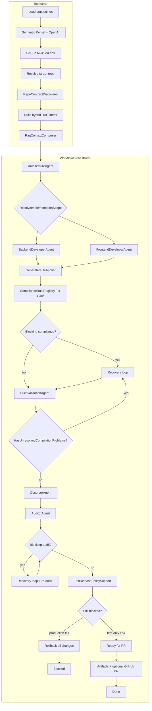

# agents-mcp-rag

Multi-agent development workflow for a **target repository**. It uses **Semantic Kernel** (OpenAI), **local hybrid RAG** (lexical + embeddings), and the **GitHub MCP server** to plan, generate, validate, audit, recover, and optionally open a pull request—all while following patterns discovered in the existing codebase.

The orchestrator is **stack-aware**: it discovers repo capabilities once, then routes apply, RAG, compliance, build validation, recovery, and test-release policy through thin generic facades into **DotNet** or **Frontend** support code.

## What it does

Given a task (e.g. “add a Timesheet entity like Employee”), the system:

1. Discovers **RepoContract** (layers, frontend layout, DI scope, composition roots) and sets **`contract.Stack`**.
2. Indexes and retrieves relevant code from the target repo (extensions and exemplars gated by stack).
3. Plans architecture, then generates backend and/or frontend files in parallel (scope from architecture + contract).
4. Applies changes with stack-aware safety gates (C# guards only when `stack.DotNet`).
5. Runs deterministic compliance rules selected by stack (`ComplianceRuleRegistry.For(stack)`).
6. Validates builds per stack (`.NET`: `dotnet build` / `dotnet test`; frontend: `npm run build`).
7. Audits output and recovers from failures in a loop.
8. For .NET repos: separates **production** vs **test** build failures so bad unit tests do not roll back good production code.
9. Writes workflow artifacts and optionally creates a GitHub PR via MCP.

---

## Stack-aware architecture

Discovery happens **once** at bootstrap. Every downstream subsystem reads `RepoContract.Stack` (or `RepoStack.From(state)`).

```
RepoContractDiscoverer.Discover(repoPath)
  └── RepoContract
        ├── Stack.DotNet     (DI scope, composition roots, layer conventions)
        ├── Stack.Frontend   (frontend module template discovered)
        └── discovered data  (PathRules, Frontend template, LayerConventions, …)

RepoStack routes at orchestration boundaries:
  ├── ApplyContext / GeneratedFileApplier     → CodeApply/DotNet/*
  ├── RagContextComposer                      → Rag/DotNet/* + FrontendRagContextSupport
  ├── ComplianceRuleRegistry.For(stack)       → DotNetComplianceRules + FrontendComplianceRules
  ├── BuildValidationAgent                    → BuildValidation/DotNet/* + FrontendBuildValidationSupport
  ├── RecoveryContextSupport                  → Orchestration/DotNet/CSharpCompilationFixSupport
  └── TestReleasePolicySupport                → Orchestration/DotNet/DotNetTestReleasePolicySupport
```

| Layer | Generic (parent) | DotNet (`*/DotNet/`) | Frontend (parent or `Frontend*`) |
|-------|------------------|----------------------|----------------------------------|
| Apply | `ApplyContentGuard`, `ApplyContext`, `GeneratedFileApplier` | `CSharpApplySupport`, DotNet guards, DI merge | `FrontendApplyGuard` |
| RAG | `RagContextComposer`, `RepoCodeFileScanner` | `CSharpRagContextSupport` | `FrontendRagContextSupport` |
| Compliance | `ComplianceRuleRegistry`, `ComplianceContext` | `DotNetComplianceRules`, auditors | `FrontendComplianceRules` |
| Build | `BuildValidationAgent` | `DotNetBuildValidationSupport` | `FrontendBuildValidationSupport` |
| Recovery | `RecoveryContextSupport`, `WorkflowFindingRules` | `CSharpCompilationFixSupport` | proposed-files-only fallback |
| Test release | `TestReleasePolicySupport` | `DotNetTestReleasePolicySupport` | no-op (extensible) |

**Convention:** stack-specific logic lives under `DotNet/` subfolders (namespaces `*.DotNet`). Generic orchestrators stay at the parent level and route with `RepoStack` helpers (`WhenDotNet`, `WhenFrontend`, `DotNetOr`, …). See [RepoStack](#repostack) below.

---

## RepoStack

`RepoStack` (`Infrastructure/RepoContract/RepoStack.cs`) is a small **routing snapshot**: two booleans that say whether the discovered repo has a .NET backend and/or a frontend module layout.

```csharp
readonly record struct RepoStack(bool DotNet, bool Frontend)
```

| Member | Purpose |
|--------|---------|
| `RepoStack.None` | Neither stack (`DotNet: false`, `Frontend: false`) |
| `contract.Stack` | Authoritative flags after discovery (see table below) |
| `RepoStack.From(contract)` | Same as `contract.Stack` |
| `RepoStack.From(state)` | Uses `state.Contract.Stack` when present; otherwise infers from RAG structure text (fallback for tests / pre-contract paths) |
| `WhenDotNet` / `WhenFrontend` | Run an action only when that stack is active |
| `WhenDotNet<T>` / `WhenFrontend<T>` | Return items or `Enumerable.Empty<T>()` |
| `DotNetOr<T>(whenDotNet, otherwise)` | Pick a value by stack |

**How `contract.Stack` is derived** (single public API — no separate `HasDotNetBackend` / `HasFrontend` properties):

| Flag | True when |
|------|-----------|
| `Stack.DotNet` | DI registration scope discovered, **or** composition roots exist, **or** at least one layer convention profile is active |
| `Stack.Frontend` | A frontend module template was discovered (`Frontend is not null`) |

Mixed repos set both flags. Downstream code should read **`contract.Stack`** or **`RepoStack.From(state)`** and branch on `stack.DotNet` / `stack.Frontend` — not re-scan the repo or duplicate discovery heuristics. Routing boundaries are listed under [Stack-aware architecture](#stack-aware-architecture).

Unit tests: `agents-mcp-rag.tests/Infrastructure/RepoStackTests.cs`.

---

## Repository contract

`RepoContractDiscoverer` scans the target repo once at startup (`RepoContractComposer` merges per-stack discoverers) and stores layout on `WorkflowState.Contract`. **`RepoContract.Stack`** is the routing entry point; other fields hold the discovered data (path rules, layer profiles, frontend template, composition roots, etc.).

| Signal | Stored on contract | Used for |
|--------|-------------------|----------|
| `Stack.DotNet` | Derived (see above) | C# apply guards, DotNet compliance, `dotnet` build/test, compilation-fix context, test quarantine |
| `Stack.Frontend` | Derived (`Frontend != null`) | Frontend RAG, path rules, `npm run build` |
| Path rules, layers, DI scope, roots | `PathRules`, `LayerConventions`, `RegistrationScope`, `CompositionRootPaths`, … | Canonical paths, compliance, RAG exemplars, apply guards |

Agents and compliance checks use this contract instead of hardcoded project-specific playbooks.

---

## Prerequisites

| Requirement | Purpose |
|-------------|---------|
| [.NET 8 SDK](https://dotnet.microsoft.com/download) | Build and run the app |
| [Node.js](https://nodejs.org/) + `npx` | GitHub MCP server; frontend `npm run build` validation |
| OpenAI API key | Chat + embeddings (hybrid RAG) |
| GitHub PAT | MCP GitHub tools (PR/status) |
| Local path or Git URL | Target repo to modify |

---

## Quick start

### 1. Configure

Edit `agents-mcp-rag/appsettings.json`:

```json
{
  "OpenAI": {
    "ApiKey": "sk-...",
    "ChatModel": "gpt-4o-mini",
    "EmbeddingModel": "text-embedding-3-small"
  },
  "GitHub": {
    "Pat": "github_pat_..."
  },
  "Repo": {
    "Path": "/absolute/path/to/your/target-repo"
  },
  "Workflow": {
    "MaxRecoveryAttempts": 3,
    "MaxCompilationFixAttempts": 3,
    "CompilationFixMaxContextChars": 200000,
    "CompilationFixMaxOptionalFiles": 0,
    "UseHybridRag": true,
    "RagLexicalWeight": 0.55,
    "RagVectorWeight": 0.45,
    "DefaultTaskPrompt": "Your default task when no CLI args are passed.",
    "AutoCreatePullRequest": true,
    "PullRequestBaseBranch": "main"
  }
}
```

`Repo.Path` can be a local directory or a remote URL (`https://...`, `git@...`). Remote repos are cloned into a local cache under `~/Library/Application Support/agents-mcp-rag/repo-cache` (macOS).

> **Security:** Do not commit real API keys. Use placeholders in git and keep secrets in a local-only `appsettings.Local.json` (ignored by `.gitignore`) if needed.

### 2. Build

```bash
cd agents-mcp-rag
dotnet build agents-mcp-rag.sln
```

### 3. Run tests

```bash
dotnet test agents-mcp-rag.sln
```

Unit tests live in `agents-mcp-rag.tests` (xUnit). They cover `RepoStack` routing, repo contract discovery/composition, canonical paths, build-failure classification, workflow finding rules, compliance rule selection, test-release policy, CodeApply edge cases, and build-validation skip behavior.

### 4. Run

```bash
dotnet run --project agents-mcp-rag/agents-mcp-rag.csproj
```

With a custom task prompt:

```bash
dotnet run --project agents-mcp-rag/agents-mcp-rag.csproj -- \
  "Implement Timesheet entity with repository, Web API controller, and AngularJS files matching Employee patterns."
```

If no CLI arguments are provided, `Workflow.DefaultTaskPrompt` from config is used.

---

## End-to-end flow



**Recovery loop** (compilation fix + auditor recovery) shares the same path:

`RecoveryContextSupport.Prepare` → `RecoveryAgent` → `GeneratedFileApplier` → `RecordNuGetPackageChanges` (DotNet only) → `BuildValidationAgent` → repeat until pass or max attempts.

Unresolved problems are detected by `WorkflowFindingRules.HasUnresolvedCompilationProblems` — stack-aware actionable build findings plus unresolved apply rejections (not raw finding count).

### Stage-by-stage

| Step | Component | Description |
|------|-----------|-------------|
| **1** | `AppSettingsLoader` | Loads `appsettings.json` from project or parent directories. |
| **2** | `KernelFactory` | Creates Semantic Kernel with OpenAI chat completion. |
| **3** | `GitHubMcpClientFactory` | Starts `@modelcontextprotocol/server-github` over stdio. |
| **4** | `RepositoryResolver` | Uses local repo or clone/pull remote URL into cache. |
| **5** | `RepoContractDiscoverer` | Discovers layout, layers, frontend template → `WorkflowState.Contract`. |
| **6** | `CodebaseRagIndex` | Scans stack-relevant extensions; builds lexical + vector index. |
| **7** | `RagContextComposer` | Structure + stack-specific exemplars + semantic retrieval → `CombinedRagContext`. |
| **8** | `ArchitectureAgent` | Plan: rationale, backend/frontend tasks, test strategy. |
| **9** | `BackendDeveloperAgent` / `FrontendDeveloperAgent` | Parallel JSON file generation (gated by `ResolveImplementationScope`). |
| **10** | `GeneratedFileApplier` | Canonical paths, C# guards when `stack.DotNet`, writes files. |
| **11** | `ComplianceRuleRegistry.For(stack)` | Shared + Frontend + DotNet rules → `ContractComplianceValidator`. |
| **12** | Recovery loop | Up to `MaxCompilationFixAttempts`; context from `RecoveryContextSupport`. |
| **13** | `BuildValidationAgent` | Routes to DotNet and/or Frontend validators; merges results. |
| **14** | `ObserverAgent` | Integration / cross-cutting review. |
| **15** | `AuditorAgent` | LLM audit + merged compliance/build findings. |
| **16** | Recovery loop | Up to `MaxRecoveryAttempts`; same recovery path as step 12. |
| **17** | `TestReleasePolicySupport` | DotNet: quarantine failing test artifacts, downgrade test-only audit findings. |
| **18** | Final gate | Rollback only on **production** build failure; else PR path. |
| **19** | Artifacts + `GitHubMcpAdapter` | Timeline, summaries, optional PR. |

### CodeApply lifecycle

Agents only **propose** files in memory (`GeneratedFile`: path + content). **CodeApply** (`GeneratedFileApplier.ApplyAsync` + `ApplyContext`) is the deterministic gate that validates and writes to disk.

```
BackendDeveloperAgent / FrontendDeveloperAgent / RecoveryAgent
        │  (JSON proposals in WorkflowState)
        ▼
GeneratedFileApplier.ApplyAsync
        │  ApplyContext.Create → RepoContract + RepoStack + catalogs (DotNet)
        │  per file: canonical path → normalize → validate → write
        │  post-pass (DotNet): DI wiring + composition-root repair
        ▼
AppliedFileChange[] captured for rollback
        ▼
Compliance + BuildValidation (check what was written, or why apply rejected)
```

#### When apply runs

| # | Trigger | Workflow stage | Source files |
|---|---------|----------------|--------------|
| **1** | After backend/frontend implementation | `Implementing` | `Backend.ProposedFiles` + `Frontend.ProposedFiles` |
| **2** | Compilation-fix loop (build/compliance failures) | `Integrating` | `Recovery.ProposedFiles` |
| **3** | Auditor recovery loop (blocking audit findings) | `Recovering` | `Recovery.ProposedFiles` |

Stage selects the file set: implementation stages use backend/frontend proposals; `Integrating` and `Recovering` use recovery proposals only.

#### What each apply pass does

| Step | Purpose |
|------|---------|
| **Canonical path** | Resolve LLM path to repo layout via `RepoContract`. |
| **Normalize** | C# cleanup when `stack.DotNet` (`CSharpApplySupport`). |
| **Validate** | Reject bad output before write — common shape, then stack-specific guards. |
| **Write** | `File.WriteAllText` only when validation passes. |
| **Post-apply (DotNet)** | Auto-add DI registrations; repair composition-root files. |
| **Track rollback** | Record path, prior existence, and previous content in `AppliedFileChange`. |

Rejected files become compliance issues (`Apply rejected 'path': reason`) and can re-trigger recovery via `HasUnresolvedApplyRejections`.

#### Stack-aware validation

| Stack | Guards (examples) |
|-------|-------------------|
| **DotNet** | Layer conventions, interface parity, entity rules, composition-root merge-only, pre-existing contract protection |
| **Frontend** | Basic JS/TS/HTML shape checks by extension |
| **Shared** | Non-prose content, balanced braces, placeholder/stub rejection |

#### Rollback

`GeneratedFileApplier.RollbackAsync` restores or deletes files using captured `AppliedFileChange` records:

- **Test quarantine (DotNet):** rolls back only failing `*Tests.cs` artifacts; keeps production code.
- **Final block:** rolls back all tracked changes when production build still fails after audit/recovery.

### Workflow stages (`WorkflowStage`)

```
Queued → Planning → Implementing → Integrating → Auditing
                              ↘ Recovering (loop) ↗
→ ReadyForPR → Done
   or Blocked (rollback / unresolved findings)
```

---

## Agents

| Agent | Role |
|-------|------|
| **ArchitectureAgent** | High-level plan and task breakdown. |
| **BackendDeveloperAgent** | C# / API / repository / entity / test files (JSON output). |
| **FrontendDeveloperAgent** | JS/TS/HTML/Angular-style files (JSON output). |
| **BuildValidationAgent** | Stack router: DotNet (`dotnet build` / `dotnet test`) and/or Frontend (`npm run build`). |
| **ObserverAgent** | Post-build integration observation. |
| **AuditorAgent** | Release-readiness review; merges with deterministic findings. |
| **RecoveryAgent** | Fixes build/apply failures using exemplar sources + contract (stack-aware error formatting). |

Implementation agents use `WorkflowState.CombinedRagContext`. **RecoveryAgent** uses `CompilationFixExemplarContext` and `CompilationFixAllowedFiles` prepared by `RecoveryContextSupport`.

---

## Build validation (stack-routed)

`BuildValidationAgent` is a thin router — it does not assume `dotnet` for every repo.

| Stack | Support class | What runs |
|-------|---------------|-----------|
| **DotNet** | `DotNetBuildValidationSupport` | Find `.sln`/`.csproj`, `dotnet build`, per-production-project build, `dotnet test` |
| **Frontend** | `FrontendBuildValidationSupport` | Find `package.json` (prefers `Frontend.WebProjectRoot`), `npm run build` when a `build` script exists |
| **Both** | Merged `AgentResult` | Combined findings; `ProductionBuildPassed` requires all stacks to pass |
| **Neither** | Skip | Medium-severity finding; no recovery loop triggered |

Error extraction is stack-specific: DotNet uses `: error ` and `Build FAILED` banners; frontend uses `ERROR in`, `Failed to compile`, `Module not found`, etc.

Actionable vs skipped findings: `WorkflowFindingRules.HasActionableBuildFindings` uses `BuildFailureClassifier.IsActionableFinding` (High/Blocker, not summary banners) for DotNet repos.

---

## LLM-first recovery

When build validation fails or blocking compliance is found, the orchestrator runs a **recovery loop** (`WorkflowOrchestrator.Recovery.cs`).

### `RecoveryContextSupport` (stack router)

| Stack | Behavior |
|-------|----------|
| **DotNet** | `CSharpCompilationFixSupport`: allowed files from build messages + contract; full exemplar sources inlined |
| **Other** | Allowed files = all proposed files; no exemplar inlining |

Called before every `RecoveryAgent` invocation.

### What goes into the recovery prompt

| Prompt section | Source |
|----------------|--------|
| Exemplar sources (full files) | `CompilationFixExemplarContext` (DotNet) |
| Allowed files (path list) | `CompilationFixAllowedFiles` |
| Build errors | `BuildValidation.Findings` (stack-aware filtering in `RecoveryAgent`) |
| Apply rejections + hints | `ComplianceIssues` |
| Repo layout | `Contract.FormatStructureSummary()` |
| Task | `Task.Description` |

`RecoveryAgent` does **not** use `CombinedRagContext` for fixes.

### Mandatory vs optional inlined files (DotNet)

`CSharpCompilationFixSupport.BuildContext` uses two tiers:

| Tier | Included | Limits |
|------|----------|--------|
| **Mandatory** | Every `.cs` / `.csproj` path in build output; siblings in those directories; layer/entity exemplars | Always inlined |
| **Optional** | Other allowed paths (ranked by relevance) | `CompilationFixMaxContextChars` (default `200000`; `0` = unlimited) and `CompilationFixMaxOptionalFiles` |

### Apply after recovery

1. `GeneratedFileApplier` writes recovery files (C# guards when `stack.DotNet`).
2. `RecordNuGetPackageChanges` (DotNet only) — `ProjectPackageAuditor`.
3. `BuildValidationAgent` runs again.

Build-message parsing for DotNet recovery is centralized in `BuildFailureClassifier` (`Orchestration/DotNet/CSharpCompilationFixSupport`).

---

## RAG pipeline

- **Scanner:** `RepoCodeFileScanner` — includes `.cs`/`.csproj` only when `contract.Stack.DotNet`.
- **Chunking:** Semantic Kernel text chunking per file.
- **Hybrid retrieval** (`UseHybridRag: true`):
  - **Lexical** — term overlap (`RagLexicalWeight`, default `0.55`).
  - **Vector** — OpenAI embeddings (`RagVectorWeight`, default `0.45`).
- **Composer:** `RagContextComposer` merges structure, stack-specific rules/exemplars, and semantic queries from `CSharpRagContextSupport` / `FrontendRagContextSupport`.

Embeddings are held **in memory** for the run (not persisted to a vector DB).

Recovery uses **on-disk full files** for DotNet error-adjacent paths, not RAG chunks.

---

## Safety and compliance (deterministic)

Compliance runs without the LLM via `ContractComplianceValidator` and `ComplianceRuleRegistry.For(stack)`:

| Scope | Rules / checks |
|-------|----------------|
| **Shared** | Architecture coverage, protected contract files |
| **DotNet** | Layer contracts, path conventions, DI wiring, interface parity, missing unit tests, package restore |
| **Frontend** | Frontend path conventions |

High/Blocker findings can trigger the recovery loop.

| Check area | DotNet location | What it enforces |
|------------|-----------------|------------------|
| Layer contracts | `DotNetComplianceRules` | I*{Role} + implementation pairs |
| Path conventions | DotNet + `FrontendComplianceRules` | Controllers, indexes, frontend module layout |
| Missing tests | `TestCoverageAuditor` | `*Tests.cs` per discovered layer |
| File quality | `GeneratedFileApplier` + `CSharpApplySupport` | C# shape, interface parity (when `stack.DotNet`) |
| Package restore | `ProjectPackageAuditor` | Missing test NuGet packages after apply |
| Bootstrap DI | `CompositionRootMerger` | Appends `services.Add*` lines only |

### Production vs test build failures (DotNet)

Handled by `TestReleasePolicySupport` → `DotNetTestReleasePolicySupport`:

| Situation | Behavior |
|-----------|----------|
| Production projects fail | Full rollback of generated changes → **Blocked**. |
| Only test project fails | **Quarantine** `*Tests.cs` artifacts, defer test entity, downgrade to Medium findings, **keep production code**, continue to PR. |
| Production passes, tests deferred | Timeline notes deferred test gate; `DeferredTestEntities` skips future test generation pressure. |

Frontend-only repos skip test quarantine (no `*Tests.cs` convention).

---

## Project structure

```
agents-mcp-rag/
├── agents-mcp-rag.sln
├── global.json
├── README.md
└── agents-mcp-rag/
    ├── Program.cs
    ├── appsettings.json
    ├── Application/
    │   └── ApplicationHost.cs
    ├── Configuration/
    ├── Workflow/
    │   ├── WorkflowRunner.cs          # Contract discover → RAG → orchestrator
    │   └── WorkflowResultPrinter.cs
    ├── Orchestration/
    │   ├── WorkflowOrchestrator.cs
    │   ├── WorkflowOrchestrator.Recovery.cs
    │   ├── WorkflowFindingRules.cs    # HasUnresolvedCompilationProblems, scope, capabilities
    │   ├── RecoveryContextSupport.cs  # Stack router for recovery context
    │   ├── TestReleasePolicySupport.cs
    │   ├── ContractComplianceValidator.cs
    │   ├── Compliance/
    │   │   ├── ComplianceContext.cs   # carries RepoStack
    │   │   ├── ComplianceRuleRegistry.cs
    │   │   ├── FrontendComplianceRules.cs
    │   │   └── DotNet/
    │   │       └── DotNetComplianceRules.cs
    │   └── DotNet/
    │       ├── CSharpCompilationFixSupport.*.cs
    │       └── DotNetTestReleasePolicySupport.cs
    ├── Agents/
    ├── Infrastructure/
    │   ├── RepoContract/
    │   │   ├── RepoContractModels.cs  # RepoContract + Stack property
    │   │   ├── RepoStack.cs             # routing snapshot + WhenDotNet/WhenFrontend
    │   │   ├── RepoContractDiscoverer.cs
    │   │   ├── RepoContractComposer.cs
    │   │   └── DotNet/                  # DotNetRepoContractDiscoverer
    │   ├── Rag/
    │   │   ├── RagContextComposer.cs
    │   │   ├── FrontendRagContextSupport.cs
    │   │   └── DotNet/
    │   │       └── CSharpRagContextSupport.cs
    │   ├── CodeApply/
    │   │   ├── ApplyContext.cs
    │   │   ├── GeneratedFileApplier.cs
    │   │   └── DotNet/                # CSharpApplySupport, guards, DI merge
    │   ├── BuildValidation/
    │   │   ├── FrontendBuildValidationSupport.cs
    │   │   └── DotNet/
    │   │       └── DotNetBuildValidationSupport.cs
    │   ├── Compliance/
    │   │   └── DotNet/                # BuildFailureClassifier, auditors, DI discoverer
    │   ├── Git/
    │   └── Kernel/
    └── Models/
        └── WorkflowModels.cs
└── agents-mcp-rag.tests/          # xUnit tests (InternalsVisibleTo)
    ├── Helpers/                   # TempRepo, WorkflowStateBuilder
    ├── Infrastructure/
    ├── Orchestration/
    ├── CodeApply/
    └── Agents/
```

## Configuration reference

| Key | Description |
|-----|-------------|
| `OpenAI:ApiKey` | OpenAI API key. |
| `OpenAI:ChatModel` | Chat model (e.g. `gpt-4o-mini`). |
| `OpenAI:EmbeddingModel` | Embedding model for hybrid RAG. |
| `GitHub:Pat` | GitHub personal access token for MCP. |
| `Repo:Path` | Local path or Git remote URL of target repo. |
| `Workflow:MaxRecoveryAttempts` | Auditor/recovery loop limit. |
| `Workflow:MaxCompilationFixAttempts` | Build-failure recovery loop limit. |
| `Workflow:CompilationFixMaxContextChars` | Max characters for optional inlined files in DotNet recovery prompt (`0` = unlimited). |
| `Workflow:CompilationFixMaxOptionalFiles` | Max optional file count after mandatory set (`0` = unlimited). |
| `Workflow:UseHybridRag` | Enable lexical + vector retrieval. |
| `Workflow:RagLexicalWeight` / `RagVectorWeight` | Hybrid score weights (should sum ~1). |
| `Workflow:DefaultTaskPrompt` | Task used when no CLI args. |
| `Workflow:AutoCreatePullRequest` | Create PR via MCP when workflow succeeds. |
| `Workflow:PullRequestBaseBranch` | Base branch for PR (e.g. `main`). |

---

## Output

- **Console:** Step banners, agent summaries, timeline.
- **Artifacts:** Written under the target repo (or configured artifact path) on success.
- **GitHub:** PR URL/status when `AutoCreatePullRequest` is enabled and the target is a git repo.

Example timeline lines:

```
2026-05-18T09:49:18Z | Architecture planning started.
2026-05-18T09:49:18Z | Repository layers (contract/RAG): backend=yes, frontend=yes
2026-05-18T09:49:18Z | Implementation scope: backend=True, frontend=True
2026-05-18T09:49:18Z | Generated files applied: SinglePageSample.Repository/...
2026-05-18T09:49:18Z | Compilation fix: inlined 8 full source file(s): ...
2026-05-18T09:49:18Z | NuGet restore: added package xunit to ...
2026-05-18T09:49:18Z | Build passed after compilation fix attempt 1.
2026-05-18T09:49:18Z | Quarantined 2 failing test artifact(s); production code retained.
2026-05-18T09:49:18Z | Workflow ready for PR.
```

## License

Add your license here (e.g. MIT) if you open-source this repository.
